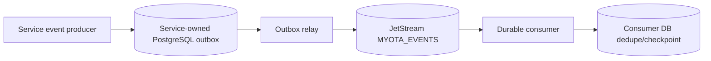

# MyOTA event contract and current JetStream implementation

NATS JetStream is the broker in the current local and Kubernetes deployment;
RabbitMQ is not configured. Services write domain events to their
service-owned PostgreSQL `outbox_event` table. Relay workers publish those
rows to JetStream, and durable consumers process them. The in-memory event list
is only the dependency-free test adapter, not the durable Compose path.



## JetStream subject and message format

The relay creates a file-backed stream named `MYOTA_EVENTS`, bound to
`myota.events.>`, with limits retention and a 30-day maximum age. It derives a
subject from `eventType` by replacing dots with underscores and prefixing
`myota.events.`. For example, `programme.created.v1` is published to
`myota.events.programme_created_v1`.

The JSON currently published to JetStream is:

```json
{
  "eventId": "uuid",
  "eventType": "programme.created.v1",
  "payload": {}
}
```

The outbox table also stores `producer`, aggregate type/id, and `occurred_at`,
but the current relay does not include those fields in the JetStream message.
`correlationId` is generated by the in-process event helper but is not persisted
by the outbox schema. Consumers must therefore use the actual wire fields
(`eventId`, `eventType`, and `payload`); do not rely on the richer envelope
previously shown in this document.

## Delivery, retries, and consumer behavior

- Relay workers claim rows with PostgreSQL `FOR UPDATE SKIP LOCKED`, publish
  with `Nats-Msg-Id` set to `eventId`, and mark the row published only after a
  JetStream acknowledgement. A crash after broker acknowledgement but before
  the database update can cause a republish, so handlers must be idempotent.
- Publish failures are retried with exponential delay (up to 300 seconds),
  with 12 attempts by default. Exhausted messages are written to the producer
  database's `dead_letter_event` table and marked as dead-lettered in its
  outbox row.
- Consumers use durable JetStream subscriptions and manual acknowledgements.
  A consumer database records processed event IDs and its latest checkpoint to
  suppress repeat handling. Handler failures are placed in that database's
  dead-letter table and the JetStream message is terminated. Unsupported event
  major versions are NAKed for redelivery; they are not currently routed to
  the dead-letter table automatically.
- The event envelope's `eventId` is stable across a relay retry. Consumers
  should also deduplicate by `(consumer, eventId)` because broker-side message
  deduplication is not a substitute for application idempotency.

## Current workers and deployment coverage

Local Compose runs outbox relays for `myota_core`, `myota_activity`, and
`myota_geo`. The Helm chart currently renders relays for `myota_core` and
`myota_geo` only; activity outbox events are not relayed in that chart yet.
Consumers currently include activity notifications (`myota.events.>`) and the
geodata import-processing worker. The notification handler turns identity
events into account-security notices and geodata review/status events into
proposal-decision notices.

Compose starts NATS with JetStream enabled and mounts its `/data` directory on
the named `nats-data` volume. The current Helm NATS template instead mounts
`emptyDir` at `/data`, so stream data is lost when that pod is replaced. Thus,
the PostgreSQL outboxes are durable, but JetStream itself is not yet persistent
across pod replacement in the chart. The chart also needs an activity outbox
relay before all three service outboxes are represented in Kubernetes.

## Geodata import-processing queue status

Administrator-confirmed imports create a durable processing-queue record and a
`geodata.import.processing.queued.v1` outbox event. The current API also hands
the queue to its in-process executor in HTTP mode. Although the event payload
contains `natsSubject: myota.geodata.import.process.v1` and a separate worker
subscribes to that subject, the generic outbox relay currently publishes the
event to `myota.events.geodata_import_processing_queued_v1` instead. There is
no direct publisher to the worker's subscribed subject in the current code.
Accordingly, the dedicated JetStream worker is not currently the path that
receives these queue notifications; the in-process dispatch is. This wiring
mismatch must be resolved before describing the import promotion queue as
JetStream-driven end to end.

## Event names currently emitted

Examples below are versioned event types emitted by service code. They are
stored as `eventType` in the outbox and reach the generic event stream using the
subject mapping described above.

- Identity: `identity.account.created.v1`, `identity.callsign.added.v1`,
  `identity.callsign.verified.v1`, `identity.callsign.retired.v1`, and account
  security/audit events.
- Programmes: `programme.created.v1`, `programme.updated.v1`,
  `programme.archived.v1`, content lifecycle events, and programme policy-draft
  events.
- Geodata: import queued/preprocessed/failed events, candidate creation and
  review/status changes, geometry/location/name changes, deletion jobs, and
  conflation events.
- Activity and awards: activation created/closed, QSO recorded, award
  definition saved/published, award request created, issuance, and rendering.

The retired `PROPOSED` entity status and `geodata.entity.proposed.v1` are not
part of the current lifecycle. Candidate origin is represented in the event
payload as `candidateSource` (adapter/import or community proposal).

## Object storage references

Events carry identifiers and domain metadata; large source files, award
backgrounds, signatures, and rendered certificates remain in their dedicated
S3-compatible object-storage buckets and are referenced by object metadata,
not embedded in JetStream messages.
