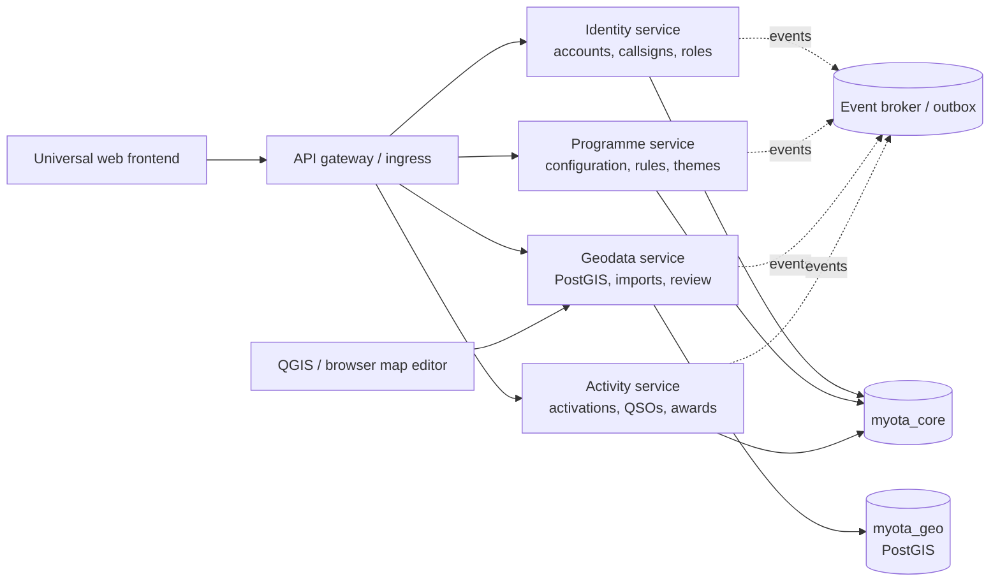
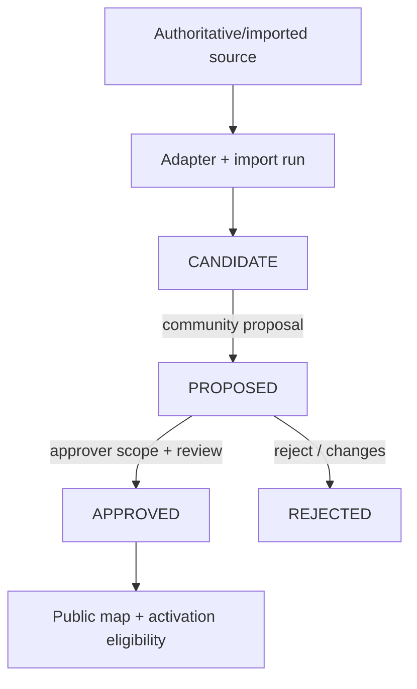

# MyOTA platform architecture

## Scope

MyOTA is an Outdoor Activation Platform. A programme is configuration and policy data consumed by platform capabilities. MPOTA is only sample seed data; future programmes use the same APIs without cloning a codebase. The platform does not copy, inherit or silently normalize another programme's charter, rules, minimum QSOs, award logic or eligibility policy. Those are programme-owned inputs, versioned and auditable as configuration or programme code.

## Service boundaries



Each service owns its database tables and publishes events. No service reads another service's tables. The gateway/ingress is a routing boundary, not a domain owner.

## Geodata lifecycle



The UI distinguishes `APPROVED` from `CANDIDATE` and never exposes a candidate as a programme reference until approval. Import refreshes update source provenance and geometry while preserving review state; an explicit policy can retire records that disappear from an authoritative source.

## Import adapters

The adapter interface is a normalized feature stream:

```text
discover(source_config) -> source snapshot metadata
read(snapshot) -> {source_record_id, name, geometry, properties, license}
normalize(feature) -> canonical geometry/properties
conflate(feature, existing) -> match candidates + score
apply(feature, policy) -> candidate/update/retire
```

Required adapters are represented in the contract and storage model: `PARKSERVE_US`, `OSM`, `GOVERNMENT_GIS`, and `MANUAL`. ParkServe and government feeds remain source-specific integrations; OSM imports preserve ODbL attribution and retrieval metadata. Manual proposals use the same entity/review path and do not bypass approval.

## Security and operations

- Short-lived access tokens are verified at the gateway; the identity service issues radio-native claims (`account_id`, participation type, verified callsigns, scopes).
- OAuth/OIDC is optional per programme configuration and is never the identity source of truth. External subject mappings point to an internal account.
- Approver authorization is scope-based: programme + jurisdiction + entity type. Review mutations require an approver scope and are audit events.
- Every mutation accepts `Idempotency-Key`; service outboxes make event publication retry-safe.
- Rate limits apply at gateway, with stricter limits for import and proposal endpoints.
- JSON logs carry request, correlation, actor and programme IDs. Health/readiness endpoints are available per service.
